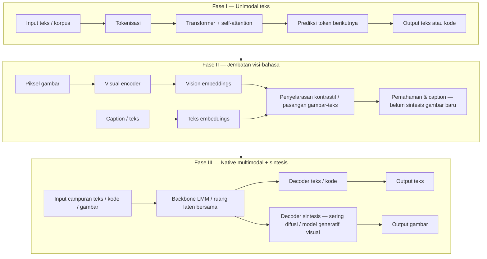

# SIDIX — feeding log & akumulasi konteks

**Tujuan:** satu tempat **mengumpulkan** input, narasi, dan keputusan desain sambil pengembangan SIDIX berjalan (“feeding” berkelanjutan).  
**Bukan** janji produk “jadi selevel X dalam 24 jam” — angka 24 jam di sini = **ritme kerja / sprint** user bila disebut; arsitektur tetap mengikuti `AGENTS.md` (own-stack, sanad/tabayyun, mode epistemik).

**Cara pakai:** tambahkan entri baru di bagian **Log feeding** (tanggal + bullet). Dokumen lain boleh tetap menjadi sumber kebenaran per topik; file ini **indeks + ringkasan + perbandingan**.

---

## Indeks dokumen terkait (repo)

| Topik | File |
|--------|------|
| Sprint ±2 jam | `docs/SPRINT_SIDIX_2H.md` |
| Sprint log sesi | `docs/SPRINT_LOG_SIDIX.md` |
| Mode epistemik (sanad + non-baku + budaya) | `28_sidix_epistemic_modes_multi_perspective.md` |
| Human Experience Engine | `29_human_experience_engine_sidix.md` |
| Blueprint stack → Mighan (Python) | `30_blueprint_experience_stack_mighan.md` |
| Metodologi makalah AI gambar + path PDF + fotogrametri/nirmana/jurnal desain | `27_image_ai_research_methods_external_refs.md` |
| Notebook Kaggle — QLoRA Qwen2.5 + zip adapter SIDIX | `notebooks/sidix_gen_kaggle_train.ipynb` + `docs/HANDOFF-2026-04-17.md` |
| Kaggle CLI — `kernels pull` + folder tarikan | `notebooks/kaggle_pulled/README.md` |
| Terjemahan (referensi eksternal) | Bagian **Terjemahan / multibahasa** di file ini |
| Taksonomi AI, RAG, agen, roadmap builder, flywheel data, zona legal, orkestrasi | Bagian **Referensi adopsi — taksonomi hingga agen** di file ini |
| Sejarah komputasi, metode ilmiah, Photoshop→digital, vektor/3D/isometrik, LLM & typo | Bagian **Sejarah komputasi hingga kognisi model** di file ini |
| Pola peneliti, reverse engineering verbal, intent classifier | Bagian **Meta — pola feeding & deteksi niat** di file ini |
| Matematika/kode sebagai pola, leverage, echo chamber, Jariyah OSS hub | Bagian **Kognisi model & Jariyah AI Hub (feeding OSS)** di file ini |
| Qada–Qadar & framing keputusan (konsep, bukan fatwa) | `32_qada_qadar_and_islamic_decision_framing_concepts.md` |
| Analogi hafiz, federasi pengetahuan, GGUF/SLM | Bagian **Pengetahuan terdesentralisasi & inferensi hemat** di file ini |
| QLoRA train/val loss, cadangan adapter, GPU Kaggle | Bagian **Fine-tune LoRA & tips IHOS** di file ini |
| Compose OSS Ollama + WebUI (contoh) | Folder repo **`jariyah-hub/`** (`docker-compose.example.yml`, `.env.example`) |
| 114 modul rilis (Projek Badar / Al-Amin) | `docs/PROJEK_BADAR_AL_AMIN_114_LANGKAH.md` + generator `scripts/generate_projek_badar_114.py` |

---

## Tema yang sudah terkumpul (ringkas)

1. **Sanad bukan penjara** — jawaban bisa multi-mode: terikat korpus, multi-perspektif, tak-baku, budaya lisan (jujur epistemik).
2. **Pengalaman manusia** — noisy tapi bernilai; struktur CSDOR + validasi pola; Experience Engine sebagai lapisan produk.
3. **Lima layer** — LLM + Experience + Value (prinsip/islamic reasoning scope) + Reasoning + output berlabel.
4. **Stack nyata** — `brain_qa`, RAG, LLM lokal SIDIX; bukan Node+OpenAI sebagai default.
5. **UI** — health, tes generate, status `model_mode`; SIDIX_USER_UI terhubung backend.
6. **Adapter LoRA** — path flat `apps/brain_qa/models/sidix-lora-adapter/`, `local_llm.py`, `/agent/generate`.
7. **Representasi & makna** — teks → token → ruang vektor; gambar (diffusion) → teks–visual; peluang **Experience Embedding** + **meaning layer** (pola pengalaman, bukan hanya kata).
8. **Joint latent space + routing** — modalitas berbeda dipetakan ke \(Z\) berdimensi tinggi; tugas berat bisa diarahkan ke “ahli” / decoder (difusi video/audio, dll.) — pola industri; nama produk = ilustrasi.
9. **Produk (arah)** — pipeline: Understanding → **Experience retrieval** → Reasoning + nilai → output teks + **visual prompt** + generator gambar opsional; beda dengan LLM yang hanya menjawab.
10. **Strategi MVP (feeding)** — utamakan **use case + output** (~70%) sebelum memperdalam engine (~30%); dataset pengalaman kecil + **prompt sistem** dulu; skala vector/RAG sesudah validasi dipakai.
11. **Midjourney vs SD (feeding)** — MJ: kalibrasi estetika + distribusi Discord + sinyal preferensi massal; SD: **latent diffusion**, kendali (ControlNet), **LoRA**, ekosistem terbuka; tradeoff **indah default** vs **presisi / literal**.
12. **Terjemahan** — opsi **self-host** ([LibreTranslate](https://github.com/LibreTranslate/LibreTranslate)) vs **vendor cloud** ([Google Cloud Translation](https://cloud.google.com/translate)); pilih sesuai `AGENTS.md` (own-stack vs kebutuhan kualitas/bahasa).
13. **Taksonomi AI** — ANI vs AGI vs ASI; memori reaktif → terbatas → theory of mind → kesadaran diri (spektrum riset / fiksi).
14. **Generatif + LLM + RAG + Agen** — empat “payung” komplementer; analogi: LLM = mesin bahasa; generatif = menciptakan data baru; RAG = memori eksternal; agen = tujuan + alat + loop tindakan.
15. **Roadmap builder** — Python/API → server & Docker → RAG (chunk, vektor, retrieval) → multi-agent orchestration; fokus **rekayasa & orkestrasi**, bukan derivatif kalkulus dari nol.
16. **Data flywheel** — injesti otomatis, metrik umpan balik, refleksi/revisi prompt, eksperimen A/B; “belajar” sistem = **pipa data + RAG**, bukan model dasar yang membengkak sendiri.
17. **Scaling & emergent** — data + parameter + komputasi → kemampuan baru (kode, multimodal); narasi vendor spesifik = ilustrasi industri.
18. **Zona data** — hijau (domain publik, dataset berlisensi jelas, data sendiri) vs abu (ToS, robots.txt, API resmi) vs merah (hak cipta, DMCA, latih tanpa izin); strategi: **base open-source + RAG/LoRA** legal.
19. **God Lab / multi-agent** — orkestrator routing tugas + ahli (riset web, visual, RAG akademik, kode+sandbox) + publisher; framework contoh: LangChain, CrewAI — **bukan** wajib stack SIDIX.
20. **Agen web minimal** — LLM + tool pencarian + persona (role/goal/backstory); deploy server; **ingat** prefer own-stack & izin data.
21. **Sejarah komputasi** — mekanis → tabung → transistor → IC → mikroprosesor → **AI sebagai generasi kelima** (narasi umum); tokoh: Babbage, Lovelace, Turing.
22. **Metode ilmiah** — observasi → masalah → hipotesis → eksperimen → analisis → kesimpulan → komunikasi; selaras **evaluasi & tabayyun** pada jawaban SIDIX.
23. **Pemikiran intelektual** — bukti, presisi, fair-mindedness; **devil’s advocate** & skenario — selaras uji adversarial sebelum publish.
24. **Photoshop & kamar gelap** — UI digital = **skeuomorf** teknik analog (dodge/burn, unsharp mask, layer, clone, filter); pelajaran UX: metafora yang dipahami user.
25. **Fisik → piksel** — blend modes (Multiply ≈ tinta; Screen ≈ cahaya); lalu **generatif** melompati meniru alat menuju sintesis hasil (caveat vendor).
26. **Vektor / 3D / isometrik** — geometri takal-rez; PBR + ray tracing; isometri 30° tanpa vanishing point — hubung ke **Galantara** & aset game.
27. **Orkestrasi “malas jenius”** — agen untuk aset modular + LLM untuk world-building + boilerplate kode + **master document** gaya.
28. **LLM & typo / “niat”** — attention + embedding + probabilitas; **bukan** baca pikiran: rekomendasi “kena” = konteks + pola populasi — **wajib jujur** di produk.
29. **Meta feeding** — urutan topik (fundamental → gambar → infra → agen) = **reverse engineering verbal**; ciri arsitek: uji **batas** jawaban, **sintesis** antar konsep, akumulasi untuk **knowledge base** internal.
30. **Matematika & kode di LLM** — bukan kalkulator sirkuit; **pola** teks + **CoT**; kode = bahasa sangat teratur + prediksi baris; “aplikasi” = mental model arsitektur + alur data.
31. **Sulit vs ngaco** — distribusi output (suhu / sampling); formal vs humor dari **pola latih**, bukan “pemilih gaya” sadar.
32. **Tanpa agensi** — model tanpa tubuh & tanpa kehendak bebas; manusia = **tuas** eksekusi; risiko **echo chamber** bila latih hanya dari keluaran AI.
33. **Jariyah / ilmu tersebar** — motivasi: pengetahuan **terdesentralisasi** (banyak salinan, banyak ingatan); paralel teknik: git, fork, mirror — bukan klaim teologi di dokumen teknik ini.
34. **Jariyah AI Hub (OSS)** — orkestrasi 24 jam (ritme sprint): Ollama/vLLM + WebUI + RAG (Chroma/Qdrant) + tool cari (mis. SearXNG) + sandbox kode; **beda produk** dari `brain_qa` SIDIX tapi pola bisa dipinjam untuk edukasi publik.
35. **Pengetahuan terdesentralisasi** — banyak salinan + banyak pelaku ingat/mengajar; mitigasi “mati satu server = hilang semua”.  
36. **Analogi hafiz (feeding)** — **ketahanan** jaring manusia terhadap kehilangan medium; dipetakan ke **replikasi** git/IPFS/node — **bukan** menyamakan bobot teknis dengan hukum/tafsir Qur’an di dokumen ini.  
37. **Federasi & IPFS** — node komunitas; aset **PDF/dataset** di IPFS (ingat lisensi); **bobot model** dibagikan mirror (patuhi lisensi model).  
38. **Preset “Hafiz-Brain”** — export/import konfig model + RAG snapshot agar komunitas tidak mulai dari nol (nama ilustratif).  
39. **GGUF & SLM** — kuantisasi + model kecil (mis. 8B q4, Phi-3-class) untuk **VRAM/RAM** pas-pasan; **antrian + cache** untuk banyak pengguna; burst cloud (Colab/Vast) untuk injesti berat.
40. **Train vs validation loss (LoRA)** — val sedikit di atas train **wajar**; waspada jika **jarak melebar** → tanda overfit / hafalan set tanpa generalisasi — perketat early stopping, eval hold-out, atau kurangi epoch.
41. **Artefak adapter** — folder `sidix-lora-adapter` (zip) = **satu-satunya** suntikan berat ke backbone; versikan nama file, simpan cadangan **di luar** repo sensitif, verifikasi `adapter_config.json` + `adapter_model.safetensors` sebelum deploy.
42. **Infra fine-tune** — T4 Kaggle cukup untuk iterasi awal; bila **validasi IHOS** (suite eval kompleks) sering OOM atau terlalu lambat → naikkan kelas GPU (A100-segment, burst RunPod/Vast) hanya untuk fase itu.

---

## Prinsip teknis inti (feeding): bahasa, gambar, multimodal

Ringkasan jujur untuk **inti mesin** — supaya desain SIDIX tidak mistis.

### Multilingual

- Data latih **multibahasa** + **satu arsitektur** → model memetakan banyak bahasa ke **ruang semantik bersama** (*shared semantic space*).
- Di level komputasi: teks → **token** → embedding/aktivasi numerik; kesejajaran makna (“makan / eat / أكل”) muncul dari **pola latih**, bukan dari kamus manual di inference.
- Akibat praktis: terjemahan, campur kode bahasa, slang — lewat **pola**, bukan karena model “punya pengalaman hidup” di negara tersebut.

### Generate gambar (umum di industri)

- Banyak sistem: **pasangan** (gambar, deskripsi) skala besar + model **teks→visual**.
- Sering memakai **diffusion**: mulai noise, denoise berulang, dikondisikan prompt teks → gambar.
- Prinsip paralel: **kata / konsep → representasi numerik → output visual** (bukan sihir; tetap interpolasi dalam ruang yang dilatih).

### Multimodal (teks + gambar + audio, dll.)

- **Satu jenis representasi terpadu** (atau jembatan antar encoder) sehingga instruksi bahasa bisa mengarahkan modul visual/audio.
- “Nyambung” terjadi karena **latihan bersama**, bukan karena model benar-benar “melihat” seperti manusia.

### Batas yang harus diingat produk kita

- Model **tidak hidup** dan **tidak mengalami** — peluang Mighan: **data pengalaman manusia terstruktur + nilai + reasoning**, bukan meniru klaim kesadaran.

### Adaptasi ke SIDIX / Experience Engine (arah kerja)

| Konsep | Arti untuk Mighan |
|--------|-------------------|
| **Experience embedding** | Kasus CSDOR / narasi pengalaman → vektor; pertanyaan user → vektor; **retrieve** yang mirip (seperti `29` + `30`). |
| **Meaning layer** | Menekankan **pola & makna** (keputusan, akibat, pelajaran), bukan sekadar permukaan bahasa. |
| **Bedanya dengan LLM umum** | Umum: kuat di **bahasa** dari data besar. SIDIX: menambahkan **pengalaman terkurasi + keputusan + filter nilai** — “generate” yang diinginkan lebih dekat **sintesis keputusan bermakna** dengan caveat. |

---

## Evolusi arsitektur: dari unimodal teks ke generasi multimodal (tiga fase)

Ringkasan **bedah evolusi** (narasi teknis umum; dipakai untuk memahami *lompatan arsitektur*, bukan klaim merek tertentu). Diagram alir:



### Fase I — Fondasi unimodal (teks saja)

- Alur linier: teks → **token** → encoder Transformer (self-attention) → **prediksi token berikutnya**.
- Model “tahu” kata seperti *kucing* lewat distribusi bahasa, tanpa grounding visual bawaan: **buta piksel** dalam arti tidak ada pipeline gambar.

### Fase II — Jembatan visi–bahasa (penyelarasan, belum “melahirkan” gambar)

- **Visual encoder** (mis. ViT, ConvNet): piksel → **vision embeddings** (vektor).
- **Contrastive learning** pada pasangan (gambar, caption) skala besar: vektor teks dan vektor gambar untuk konsep yang sama **didekatkan** di ruang matematis.
- Batas: kuat untuk **pemahaman pasif** (caption, VQA), **belum** untuk menghasilkan gambar baru dari teks — perlu mesin generatif terpisah atau fase berikutnya.

### Fase III — Sintesis multimodal “native” (konsep umum LMM)

- Satu **backbone** dilatih dengan data **multimodal campuran** (bukan sekadar menempel modul visi di atas LM teks pura).
- **Joint embeddings / ruang laten bersama**: teks, kode, dan sinyal visual dipetakan ke representasi yang bisa dipadukan untuk tugas campuran.
- **Dua (atau lebih) kepala output** dari representasi bersama:
  - decoder **teks/kode** untuk jawaban verbal;
  - **jalur sintesis visual** — di banyak sistem digambarkan sebagai **model difusi** (noise → denoising berulang) yang **dikondisikan** oleh kondisi dari backbone multimodal atau proyeksi dari prompt/teks.
- Catatan feeding: nama produk atau kode internal (mis. sebutan model gambar tertentu dalam narasi vendor) **tidak** perlu dianggap spesifikasi SIDIX; yang dipetik di sini hanya **polanya**: *LMM bersama + decoder difusi untuk piksel*.

**Kesimpulan untuk desain:** evolusi ini menjelaskan mengapa “bisa gambar” bukan sekadar *fitur tambahan*, melainkan **rekayasa penyatuan representasi + mesin generatif visual**. Untuk Mighan, paralel konseptualnya adalah menyatukan **makna / pengalaman / sanad** dalam satu lapisan keputusan — bukan menempel API tanpa filosofi data.

---

## Konteks industri (perbandingan): dari “titik nol” ke model besar

Ringkasan **naratif skala lab/industri** (Transformer → pelatihan massif → alignment → multimodal), dipakai hanya untuk **membedakan skala** dengan pendekatan Mighan — **bukan** klaim bahwa SIDIX harus meniru seluruh pipeline ini.

| Tahap | Inti |
|-------|------|
| **2017 — Transformer** | Makalah *Attention Is All You Need*; fondasi pemahaman **konteks** (bukan sekadar kata per kata). |
| **Organisasi riset** | Penggabungan arah riset besar (mis. Google Brain + DeepMind → kesatuan untuk proyek generasi berikutnya). |
| **Pelatihan** | Pre-training pada data skala besar (teks, gambar, kode, dll. sesuai produk); fine-tuning + **RLHF** (rating manusia → perilaku lebih selaras instruksi/keamanan). |
| **Generasi / kemampuan** | Evolusi versi model; context window besar; kemampuan **multimodal** (teks, gambar, video, audio, dll. — tergantung produk). |
| **Keterbatasan umum LLM** | Bukan manusia; tidak pengalaman langsung; bisa salah/halusinasi; bias data — tetap relevan untuk **transparansi** produk kita. |

**Insight untuk Mighan:** industri membangun **pencakar langit matematika + data**; kita menambahkan **lapisan pengalaman terstruktur + nilai + mode jawaban** agar “kepintaran” tidak hanya probabilitas kata.

---

## Kontras satu halaman: industri vs Mighan

| Dimensi | Pola industri (umum) | Arah SIDIX / Mighan |
|---------|------------------------|---------------------|
| Data | Skala besar, umum | Korpus terkurasi + **experience** bertag + prinsip |
| Kebenaran | Pola statistik | **Sidq / tabayyun** + sanad bila domain meminta audit |
| Output | Generate cepat | **Sintesis** dengan label mode + caveat |
| Stack | Vendor / cloud default | **Self-host** sebagai inti (`AGENTS.md`) |

---

## Narasi pipeline kelas lab (feeding — ringkas, bukan spesifikasi SIDIX)

Ringkasan **narasi umum** bagaimana model besar kelas industri dibuat (teks + multimodal). Dipakai untuk **literasi**, bukan klaim bahwa SIDIX mengikuti seluruh langkah atau infrastruktur yang sama.

| Lapisan | Inti |
|---------|------|
| **Data & arsitektur** | Korpus besar: teks, kode, gambar, audio, video (sesuai produk). **Transformer** untuk konteks jangka panjang. Varian “native multimodal” dilatih **bersama** modalitas, bukan sekadar menempel encoder visi belakangan. |
| **Pre-training** | Objektif umum: **prediksi / pemodelan urutan** (mis. token berikutnya) pada skala sangat besar → pola bahasa, penalaran, kode, fakta statistik dunia. Membutuhkan komputasi massif (contoh narasi industri: akselerator khusus). |
| **Penyelarasan** | **Fine-tuning** + umpan balik manusia (**RLHF** atau setara): jawaban “lebih membantu / lebih aman” diberi sinyal positif; perilaku tidak aman dikoreksi. Kebijakan AI / keamanan produk sebagai batas tambahan. |
| **Iterasi** | Versi berbeda (latensi vs kemampuan), **context window** besar, integrasi produk — model tetap **bukan** entitas statis sekali jadi. |

**Untuk Mighan:** paralel organisasinya adalah **data pengalaman + nilai + mode jawaban**, bukan menyaingi skala pre-training universal.

---

## Joint latent space & terminologi (akademis / industri)

### Ide inti

Modalitas mentah (teks, piksel, frame video, sampel audio) berbeda format; di dalam model, banyak sistem memetakan ke **representasi laten** \(Z\) berdimensi tinggi. Pelatihan multimodal mendekatkan \(Z\) untuk **konsep yang sama** lintas modalitas:

\[
Z \approx E_{\text{text}}(\text{teks}) \approx E_{\text{image}}(\text{gambar}) \approx \cdots
\]

Prompt teks lalu mengaktifkan region \(Z\) yang relevan; **decoder** modalitas-spesifik (mis. difusi untuk gambar) merender keluaran.

### Tabel terminologi (kaidah umum)

| Istilah | Modalitas | Inti |
|---------|-----------|------|
| **Denoising diffusion** | Gambar, video | Susun data dengan membalikkan proses noise bertahap → gambar/video tajam. |
| **Spatiotemporal consistency** | Video | Objek konsisten di **ruang** dan **waktu** (kurangi flicker antar-frame). |
| **Waveform synthesis** | Audio | Bangun gelombang mentah (mis. sample rate tinggi), bukan hanya MIDI. |
| **Mixture of Experts (MoE)** | Arsitektur | Rute dinamis ke sub-model “ahli” untuk efisiensi atau spesialisasi. |

---

## Orkestrasi (routing intent → decoder)

**Konsep umum:** backbone bahasa/multimodal mengurai **maksud**; tugas berat diarahkan ke modul khusus (generasi gambar, video, audio) lewat API internal atau orkestrator.

- **Catatan feeding:** nama produk / model dalam narasi vendor (gambar, video, musik, watermark AI, dll.) adalah **ilustrasi industri** — implementasi SIDIX mengikuti `AGENTS.md` (own-stack; hindari vendor API sebagai default bila kebijakan repo menghendaki).

---

## Arsitektur produk (arah SIDIX): “content + decision engine”

Alur target yang diusulkan dalam feeding (diselaraskan dengan `29` / `30`):

```text
User input
  → Understanding layer (LLM)
  → Experience retrieval (vector / tag — mulai sederhana)
  → Reasoning + value layer
  → Output engine
        ├─ Text insight (caption, angle, sintesis)
        ├─ Visual prompt (untuk generator gambar / desain)
        └─ (Opsional) Image generator — lokal / self-host preferred
```

**Use case contoh (feeding):** masalah manusia (mis. burnout, takut resign) → ambil pengalaman mirip → analisis pola (regret vs berhasil) → insight non-kosong → aset visual (quote, carousel, thumbnail).

---

## Strategi MVP (feeding — urutan kerja)

| Prioritas | Isi |
|-----------|-----|
| **Dulu** | Satu use case tajam; **prompt sistem** + 50–100 entri pengalaman **manual**; output: insight + caption + visual prompt. |
| **Belum wajib di hari pertama** | Vector DB kompleks, scraping massal, orkestrasi model besar multi-modal penuh. |
| **Sesudah validasi** | Kumpulan output terbaik → dataset; retrieval embedding; perdalam engine. |

**Rasio praktis (feeding):** ~**70%** nilai pada **use case + format output** yang dipakai orang; ~**30%** pada kedalaman engine — supaya tidak “mesin keren tanpa pembeli”.

---

## Pola prompt sistem (inti — template ringkas)

Struktur yang disarankan dalam feeding (sesuaikan dengan bahasa & nilai SIDIX):

1. Peran: sintesis **berbasis pengalaman manusia**, bukan motivasi kosong.  
2. Aturan: pola realita; hindari klise.  
3. Keluaran berstruktur: **INSIGHT** → penjelasan → **angle konten** → **caption** → **VISUAL_PROMPT** (detail, gaya).  
4. **Varian mode** (opsional): brutal jujur / relatable / strategis-bisnis — mengubah tone, bukan mengganti fakta.

**Kalibrasi konten (15 topik contoh dari feeding — untuk tes konsistensi):** capek kerja; takut mulai bisnis; overthinking; uang habis terus; relasi toxic; malas; bangkrut; kesepian; minder; burnout; tidak konsisten; takut gagal; hidup stuck; cari jati diri; insecure.

---

## Prompt gambar (empat elemen)

Agar generator visual (difusi) mendapat “koordinat” yang jelas, gabungkan:

1. **Subjek** — fokus utama.  
2. **Konteks** — aksi / lokasi / situasi.  
3. **Gaya visual** — fotorealistik, ilustrasi, 3D, dll.  
4. **Suasana & pencahayaan** — muram, sinematik, neon, lembut, dll.

---

## Midjourney vs Stable Diffusion (feeding — narasi produk & teknis)

Ringkasan dari **cerita produk + konsep teknis** umum di komunitas. Bukan audit hukum atau klaim internal vendor; gunakan untuk **desain produk** (estetika vs kontrol) dan **literasi** stack gambar.

### Asal-usul & filosofi Midjourney (narasi publik)

- Laboratorium kecil, **self-funded** (~2021); pendiri berlatar **Leap Motion** (sensor tangan).
- Tesis produk: memperluas **imajinasi** manusia — bukan necessarily mengejar **AGI** atau “AI serbabisa” akademis semata.
- **Discord sebagai platform beta** (~pertengahan 2022): generasi gambar jadi **sosial** — prompt terlihat, dimodifikasi, dipelajari bersama (efek jaringan + edukasi implisit pengguna).

### “Arsitektur estetika” — kenapa default terasa artistik?

- Banyak model difusi awal dioptimalkan untuk **kesesuaian teks–gambar** yang *literal* (apel di meja → apel standar).
- Narasi Midjourney: **fine-tuning berat** pada korpus **seni rupa, lukisan, fotografi pro, concept art** → model “belajar” **komposisi** (rule of thirds, dll.), **pencahayaan** (mis. volumetrik), **palet warna** dramatis.
- Akibat praktis: prompt minimal sering menghasilkan gambar yang sudah “**diperindah**” — seperti **prior estetika** kuat di sampling / bobot latih.

**Tradeoff (penting untuk produk):** sulit mendapatkan output **netral teknis** (diagram medis presisi, foto “biasa saja”, ilustrasi datar) tanpa melawan bias model — **hilangnya kendali literal** dibanding sistem yang lebih harfiah.

### Umpan balik massal & Discord (konsep)

- Interaksi publik (upscale, pilihan variasi, dll.) menghasilkan **sinyal preferensi** skala besar — dalam literatur produk sering dibandingkan dengan ide **preferensi manusia** / alignment, meskipun **rincian implementasi** di balik layar tidak dipublikasikan penuh.
- **Catatan epistemik:** jangan menyamakan “klik komunitas” otomatis dengan **RLHF** makalah tanpa sumber; aman untuk desain: **kualitas kolektif + loop produk** memang bisa memperkeras “selera” output.

### Mitigasi di sisi pengguna (Midjourney)

- **Parameter** (narasi komunitas): mis. `--stylize`, `--chaos` — mengatur seberapa “bebas” model menambahkan dramatisasi vs mengikuti prompt.
- **Pembobotan kata** — memaksa fokus ke fragmen prompt tertentu.

### Stable Diffusion — fondasi berbeda (kendali & latent)

| Aspek | Inti |
|--------|------|
| **Latent Diffusion Model (LDM)** | Difusi dijalankan di **ruang laten** terkompresi (bukan piksel penuh sepanjang waktu) → lebih hemat VRAM → jalan di **GPU konsumen** (dengan batasan). |
| **Open-source** | Kode & bobot dapat diadaptasi; muncul **ControlNet**, **LoRA**, workflow komunitas. |
| **Kendali** | **ControlNet**: salinan cabang jaringan yang mengunci **geometri** dari kondisi (pose, edge, depth); isi tekstur dari teks. **LoRA**: adaptor rank rendah (file kecil) menempel pada backbone — paralel dengan **adapter SIDIX** di repo (`apps/brain_qa/models/sidix-lora-adapter/`). |

### ControlNet — kondisi umum (bukan daftar lengkap)

| Sinyal kondisi | Kegunaan ringkas |
|----------------|------------------|
| **OpenPose / pose** | Kerangka sendi → pose tubuh tanpa harus menyalin pakaian/objek referensi. |
| **Canny / edge** | Garis besar bentuk dari foto atau sketsa. |
| **Depth map** | Struktur ruang depan–belakang. |

Contoh feeding: foto “pegang sapu” → ekstraksi **pose saja** → prompt “ksatria futuristik + pedang laser” mengisi kulit visual di atas geometri yang sama.

### Sampler & langkah (sampling)

- **Sampler** (Euler, DPM++, dll.): aturan matematis tiap langkah **denoise**.
- **Steps** (~20–30 umum): lebih banyak langkah sering = lebih halus / stabil — dengan biaya waktu dan risiko “oversharpen” tergantung pipeline.

### Menjalankan SD: tiga jalur (ringkas)

| Jalur | Inti | Catatan |
|-------|------|---------|
| **Lokal** | VRAM GPU (umumnya **NVIDIA + CUDA** dominan di ekosistem); RAM sistem. | Spek “pas-pasan” bisa jalan dengan resolusi/langkah lebih rendah; latensi lebih tinggi. |
| **Cloud GPU (VPS)** | Instance Linux + Docker image siap pakai; bayar per jam; **network volume** untuk menyimpan checkpoint. | Fleksibel; pantau biaya & privasi data. |
| **Colab / notebook** | Jupyter di-host; GPU alokasi dinamis; sering **mount Drive** untuk model/output. | Session terbatas; unduh ulang model bisa menjengkelkan; kebijakan penggunaan berubah. |

### Antarmuka & ekosistem

- **WebUI:** **Automatic1111** (panel lengkap, populer) vs **ComfyUI** (graf node, modular, sering lebih hemat VRAM untuk workflow cermat).
- **Model & aset:** **Hugging Face** (model/checkpoint, paper weights); **Civitai** (komunitas LoRA, style, prompt — perhatikan lisensi & konten).

### Paralel untuk SIDIX / Mighan

- **Kalibrasi “suara visual”** (seperti prior estetika MJ) vs **mode literal / tabayyun** (diagram, fatwa visual?) — bisa dipisah sebagai **preset output** atau **mode produk**, bukan satu model tanpa label.
- **LoRA / adaptor** sudah menjadi pola di stack lokal kita; **ControlNet-equivalent** untuk produk bisa berarti **struktur CSDOR / template** yang mengunci fakta sebelum LLM “hias” narasi — analogi kontrol geometri vs kontrol isi.

---

## Terjemahan / multibahasa (referensi stack)

Referensi feeding untuk **lapisan bahasa** (bukan pengganti multilingual internal LLM, tapi **API / layanan terjemahan** bila produk perlu).

| Opsi | URL | Catatan singkat |
|------|-----|------------------|
| **LibreTranslate** (open source, bisa self-host) | https://github.com/LibreTranslate/LibreTranslate | Selaras **own-stack** / privasi; kualitas & cakupan bahasa bergantung model Argos dsb. di deployment. |
| **Google Cloud Translation** | https://cloud.google.com/translate | API terkelola; cakupan bahasa luas; **vendor** — cocok bila kebijakan produk mengizinkan cloud & SLA. |

**Desain:** pertimbangkan **kapan** menerjemahkan (UI saja vs korpus vs jawaban) agar **sanad / makna** tidak “pecah” karena terjemahan otomatis; beri label sumber bila perlu **tabayyun**.

---

## Referensi adopsi — taksonomi hingga agen (feeding komprehensif)

Materi di bawah ini **dirangkum untuk adopsi** ke SIDIX/Mighan: definisi, taksonomi, komponen sistem, roadmap praktik, flywheel, hukum/etika data, dan orkestrasi agen. Bukan klaim bahwa satu vendor atau framework wajib dipakai.

### Definisi paling sederhana

- **AI** di sini: simulasi aspek **kognitif** (pola, adaptasi, keputusan) di komputer — berbeda dari program **if-then** statis murni.
- **Machine learning:** belajar dari data; generalisasi ke input baru (dalam batas distribusi latih).

### I. Kapabilitas (tingkat kecerdasan — lensa akademis)

| Jenis | Nama lain | Inti | Status praktis |
|-------|-----------|------|----------------|
| **ANI** | Weak AI | Satu atau sekumpulan tugas spesifik sangat kuat | **Semua** sistem produksi saat ini |
| **AGI** | Strong AI | Kecerdasan manusia lintas tugas, belajar mandiri luas | Target riset; **belum** terbukti sebagai produk |
| **ASI** | — | Melampaui gabungan manusia di hampir semua dimensi | Teori / fiksi ilmiah |

**Adopsi SIDIX:** kita mendesain untuk **ANI bermakna** + **kontrol produk** (sanad, experience, nilai) — tidak mengandaikan AGI.

### II. Fungsionalitas (memori & arsitektur)

| Kelas | Memori / belajar | Contoh feeding |
|-------|------------------|----------------|
| **Reactive** | Tidak menyimpan episode masa lalu; reaksi ke state sekarang | Deep Blue (langkah optimal dari papan saat ini) |
| **Limited memory** | Konteks / riwayat terbatas untuk keputusan | Mobil otonom (jejak detik terakhir); **chat LLM** (konteks sesi) |
| **Theory of Mind** | Model entitas lain punya keyakinan/emosi | Riset awal / aspirasi sosial |
| **Self-aware** | “Keakuan” / emosi mesin | Filosofis; **tidak** diasumsikan ada |

### Payung: Generatif, LLM, agen, RAG

| Komponen | Peran | Catatan adopsi |
|----------|--------|-----------------|
| **Generative AI** | Menciptakan **data baru** (teks, gambar, audio, …) | Beda dari AI klasik yang hanya klasifikasi/rekomendasi |
| **LLM** | Subset generatif untuk **bahasa & kode**; secara operasional: **prediksi berantai token** (probabilitas tingkat tinggi) | Otak teks; tetap bisa halusinasi |
| **RAG** | **Retrieve** potongan dokumen relevan → **augment** prompt → **generate** | “Perpustakaan” korpus sendiri / sanad; mitigasi halusinasi **parsial** |
| **AI agent** | LLM + **tujuan** + **memori** + **tools** + loop aksi | “Pekerja”; butuh batas aman, audit, dan izin tool |

**Analogi operasional (feeding):** LLM ≈ mesin bahasa/intensi; generatif ≈ kemampuan menciptakan; RAG ≈ ingatan dokumen terkurasi; agen ≈ **wujud orkestrasi** yang mengeksekusi rangkaian tugas.

### Roadmap praktis “AI builder” (empat fase — ringkas)

| Fase | Fokus | Isi |
|------|--------|-----|
| **1** | Fundamental | Python (variabel, loop, dict, fungsi); **HTTP + JSON**; memanggil API LLM |
| **2** | Infrastruktur | VPS/Linux, SSH, firewall; **Docker** atau venv; proses jalan stabil |
| **3** | Pengetahuan | **Chunking** dokumen; **embedding** & **vector DB**; logika retrieval; prompt gabungan |
| **4** | Multi-agent | Persona per agen; **workflow** antar agen; deployment otomatis ke API/CMS |

**Versi “solo founder” (feeding):** (1) pipa API + parsing JSON → (2) “pabrik” 24/7 + keamanan akses + auto-restart → (3) RAG sebagai **ledger / indeks** terdistribusi pada potongan teks → (4) “lab” multi-agent: peneliti, kritikus, publisher, dll.

### Data flywheel (sistem yang “tajam” tanpa membesarkan satu checkpoint)

1. **Injesti otomatis** — cron/script menarik sumber **legal** → chunk → embed → indeks RAG (bukan scrape sembarangan).  
2. **Umpan balik metrik** — reject rate, revenue, traffic → sinyal untuk filter data / template.  
3. **Refleksi agen** — ringkasan kegagalan → usulan revisi **prompt sistem** atau kebijakan (manusia setujui bila produksi).  
4. **Eksperimen** — mis. 80% produksi proven, 20% eksplorasi; promosi strategi yang menang.

**Adopsi:** paralel dengan **feeding log `31`**, evaluasi kualitas jawaban SIDIX, dan **CID/manifest** penyimpanan yang sudah ada di repo — bukan auto-rewrite model tanpa tata kelola.

### Kenapa kemampuan “tiba-tiba” naik (pola industri)

- **Scaling laws + data lebih kaya** (mis. kode dari repositori & forum) → kemampuan koding & alat lebih kuat pada model besar.  
- **Emergent abilities** — kemampuan yang tidak dirancang eksplisit per tugas muncul pada skala tertentu (hati-hati: bukan sihir; tetap interpolasi & bias).  
- **Visual:** difusi + data + penyelarasan → anatomi & pencahayaan lebih konsisten.  
- **Video / audio / real-time:** konsistensi **temporal**, sintesis **gelombang**, arsitektur **streaming** — lihat juga tabel terminologi di atas.  
- **Catatan:** nama produk spesifik dalam narasi vendor (gambar, video, musik, live) hanya **ilustrasi**; SIDIX mengutamakan **own-stack** sesuai `AGENTS.md`.

### Zona data (etika & kelangsungan bisnis)

| Zona | Isi | Contoh |
|------|-----|--------|
| **Hijau** | Aman untuk latih / indeks / RAG | Domain publik; dataset **lisensi jelas** (HF/Kaggle MIT-Apache); **data milik sendiri** |
| **Abu** | Publik tapi terikat aturan | **ToS** situs; hormati **robots.txt**; utamakan **API resmi** |
| **Merah** | Risiko IP / hukum tinggi | Karya berhak cipta tanpa izin; kemiripan ekstrem berujung **DMCA** / ban platform |

**Adopsi:** sanad & korpus Mighan = prioritas **hijau** + dokumen sendiri + sumber berizin; **bukan** “scrape everything, minta maaf nanti”.

### Arsitektur “God Lab” (multi-agent — blueprint feeding)

1. **Orkestrator** — satu LLM “pintu gerbang”: pecah intent → delegasi (riset / tulis / visual / kode).  
2. **Ahli** — agen dengan tool: pencarian web (API pihak ketiga **bila** kebijakan mengizinkan), difusi/visual, RAG jurnal internal, **sandbox** eksekusi kode.  
3. **Publisher** — format HTML/upload/metadata — otomatisasi output.

**Framework contoh (industri):** LangChain, CrewAI — hanya **kabel** orkestrasi; evaluasi vendor vs kode tipis di `brain_qa`.

### Agen web tunggal (MVP agen — tiga pilar)

| Pilar | Isi |
|-------|-----|
| **Otak** | LLM (lokal SIDIX atau API sesuai kebijakan) |
| **Senjata** | Tool browse/search yang **patuh** ToS & rate limit |
| **Roh** | System prompt: **role**, **goal**, **backstory** / batas gaya |

Alur: jalankan di server → tool tarik sumber → ringkas/tulis → simpan `.md` / DB / pipeline berikutnya.

### Kotak adopsi SIDIX / Mighan (olah untuk kita)

| Ide feeding | Arah implementasi |
|-------------|-------------------|
| Taksonomi ANI | Produk = **ANI + lapisan nilai + pengalaman**; komunikasikan batas ke user |
| RAG | Sudah selaras **sanad** + `brain_qa` / korpus; perdalam chunk + retrieval + label sumber |
| Agen | **`brain_qa` + gateway** (persona router, tool terbatas, audit log) — orkestrasi tipis |
| Flywheel | Feeding `31` + metrik jawaban + **tidak** auto-ubah model tanpa review |
| Zona data | Pedoman ingest korpus; **tabayyun** pada kutipan |
| Multi-model “GPT+Claude+Gemini” | Di industri = **banyak model/agen**; kita: **SIDIX lokal + modul opsional**, bukan janji satu otak serba bisa |

---

## Sejarah komputasi hingga kognisi model (feeding — referensi & adopsi)

Ringkasan untuk **literasi tim** dan desain produk (bukan kurikulum lengkap). Angka generasi = **narasi pedagogis** umum; batas antar generasi bisa berbeda per sumber.

### Garis waktu (inti)

| Periode / generasi | Inti teknologi | Catatan |
|--------------------|----------------|---------|
| **Pra-elektronik** | Sempoa / abacus (referensi umum ~millenium SM, mis. ~2400 SM pada narasi feeding) | Alat hitung manual |
| **1822** | Babbage — *Difference Engine* / arah *Analytical Engine* | Cikal bakal program & mesin mekanik |
| **1842** | Ada Lovelace — catatan algoritme | Programer pertama (narasi standar) |
| **Gen 1 (~1940–1956)** | Tabung vakum | ENIAC (1946), besar & panas |
| **Gen 2 (~1956–1963)** | Transistor | Lebih kecil & hemat |
| **Gen 3 (~1964–1971)** | Sirkuit terpadu (IC) | Integrasi chip |
| **Gen 4 (1971→)** | Mikroprosesor (mis. Intel 4004) | PC, Apple II, IBM PC |
| **Gen 5 (narasi “sekarang”)** | AI, paralelisme, material/komputasi mutakhir | **Tetap ANI** dominan produk |

**Alan Turing:** fondasi teori komputabilitas & mesin abstrak — jembatan matematika → komputer modern.

### Cara berpikir ilmuwan (olah untuk evaluasi SIDIX)

| Aspek | Inti |
|--------|------|
| **Objektif & empiris** | Klaim mengikuti data & pengulangan |
| **Sistematis** | Alur: observasi → pertanyaan → hipotesis → uji → analisis |
| **Kritis** | Skeptis sehat terhadap klaim tanpa bukti |
| **Terbuka** | Revisi teori bila bukti lebih kuat (falsifikasi) |
| **Analitis** | Memecah masalah kompleks |

**Tahapan metode ilmiah (checklist internal):** observasi → identifikasi masalah → hipotesis → eksperimen → analisis data → kesimpulan → publikasi/peer review.

**Adopsi:** mapping ke **pipeline uji jawaban** (golden questions, human review, metrik halusinasi) + **sanad** untuk klaim faktual.

### Pemikiran intelektual (standar argumen)

- **Komponen:** analitik + kreatif; kerangka sebab-akibat; kerendahan intelektual; integritas argumen.  
- **Latihan:** cari bukti; tulis untuk jernih; **devil’s advocate**; simulasi skenario; refleksi keputusan buruk.  
- **Standar (Paul Elder–style):** kejelasan, akurasi, presisi, **fair-mindedness**.

**Adopsi:** kriteria QA untuk **mode jawaban** dan redaksi caveat SIDIX.

### Photoshop: dari kamar gelap ke piksel (narasi produk)

| Fakta ringkas | Isi |
|---------------|-----|
| **1987** | Thomas Knoll — program “Display” (grayscale Mac); berkembang ke editor piksel |
| **Kolaborasi** | John Knoll (ILM) — dorongan fitur profesional; nama *ImagePro* |
| **1988–1990** | Lisensi Adobe → **Photoshop 1.0** (1990, Mac) |
| **DNA analog** | Ayah fotografer → metafora **darkroom**: dodge/burn (kartu/tangan), **unsharp mask**, **layer/mask**, **clone stamp** retouch fisik, **filter** kaca |

**Pelajaran produk:** alat yang sukses sering **meniru workflow** yang sudah ada di dunia nyata (**skeuomorfisme**) — lalu disederhanakan seiring literasi digital.

### Dari hukum cahaya fisik ke blend mode matematis

- **Multiply** — analogi tinta tumpuk / absorpsi → operasi piksel gelapkan.  
- **Screen** — analogi dua sumber cahaya → terangkan.  
- **Evolusi:** skeuomorf alat → **generatif** yang langsung mensintesis adegan (tanpa mensimulasikan setiap kuas); tetap berbasis model & data.

### Tiga pilar “dunia fisik di layar”

| Pilar | Inti | Kait proyek |
|-------|------|-------------|
| **Vektor** | Geometri parametrik, tak pecah saat skala | Logo, UI, asset bersih |
| **3D** | Volume, tekstur **PBR**, **pencahayaan / ray tracing** | Adegan, produk |
| **Isometrik** | Proyeksi ~30°, tanpa vanishing point → “Lego” 2D | **Galantara**, tile, bangunan |

### “Malas jenius” + orkestrasi (adopsi)

- Agen **visual** + prompt master + **modular assets** + skrip procedural.  
- LLM sebagai **mitra world-building** (uji logika, bukan satu-satunya sumber kebenaran).  
- **Code assistant** untuk boilerplate; manusia di **arsitektur & review**.  
- **Master document** gaya + palet diselaraskan narasi.

### Kenapa LLM “tahan typo” & terasa “paham niat”

| Mekanisme | Penjelasan singkat |
|-----------|-------------------|
| **Self-attention** | Hubungan token-token sekaligus, bukan hanya urutan kaku |
| **Tokenization + embedding** | Subkata / pola; “Gua” dekat “Saya” di ruang vektor pada model yang dilatih bahasa informal |
| **Prediksi berantai** | Kalimat berikutnya yang paling mungkin diberi konteks — “memperbaiki” ejaan lemah sebagai byproduct |

**Batas epistemik (wajib untuk SIDIX):**  
Ini **bukan** membaca pikiran biologis; “**latent intent**” / rekomendasi yang pas = **konteks sesi + pola statistik dari korpus latih + prior prompt**. Framing “cold reading” = **heuristik** yang bisa salah — produk harus **menyatakan ketidakpastian** dan **tidak** mengklaim empati atau telepati.

**Adopsi:** saluran **tabayyun** + label “inferensi” vs “fakta tersanad”; hindari UI yang menyiratkan model “tahu” user lebih dalam dari yang user ungkapkan.

---

## Meta — pola feeding peneliti & “deteksi niat”

Catatan feeding dari **refleksi pola percakapan**: user mengumpulkan materi dengan urutan yang menyerupai **bedah lapisan** (dari definisi AI → generatif → infrastruktur → RAG/agen → sejarah tool → kognisi model).

### Ciri pola “system architect” (bahasa kerja, bukan diagnosis psikologis)

| Pola | Arti untuk proyek |
|------|-------------------|
| **Evaluatif** | Menuntut kedalaman & batas keabsahan (“jangan permukaan”) → setara **uji adversarial** pada dokumen & jawaban |
| **Sintesis antar konsep** | Menghubungkan kamar gelap → Photoshop → AI generatif → **satu garis evolusi** untuk fondasi desain |
| **Akumulasi terstruktur** | Obrolan → **feeding log `31`** + korpus / RAG / agen — **bukan** “kesadaran” lawan bicara |

### Apa yang dimaksud “sadar” di sisi model (teknis, bukan fenomenologi)

- **Bukan** kesadaran emosional atau empati biologis.  
- **Intent routing / klasifikasi** (narasi produk: informational vs evaluative vs architectural) = **label prediktif** dari teks + konteks sesi — bisa dilatih atau diatur rule; outputnya **hipotesis niat**, bisa salah.  
- Respons model yang “pas” memperkuat ilusi **pemahaman mendalam**; itu **fitur bahasa**, bukti telepati.

**Adopsi SIDIX:**

- Anggap sesi feeding user sebagai **spesifikasi implisit** — sudah tercermin di struktur `31`.  
- Pada produk: bedakan **mode tanya** (info) vs **mode audit** (evaluatif) bila perlu; log **sumber** dan **tingkat keyakinan**.  
- Jangan meniru klaim chatbot “gue paham banget lo” sebagai **janji produk**; gunakan **sidq**: “ini inferensi dari pola pertanyaan, bukan pembacaan pikiran.”

---

## Kognisi model & “Jariyah AI Hub” (feeding — OSS + nilai)

### Matematika, rumus, koding, aplikasi (bagaimana model “terlihat” bisa)

| Topik | Penjelasan adopsi (bukan hafalan manusia) |
|--------|------------------------------------------|
| **Matematika** | Latihan pada teks soal & paper → **pola simbol & langkah**; **chain-of-thought** (uraian langkah) meniru jejak bukti di korpus; tetap bisa salah pada edge case. |
| **Ngoding** | Bahasa formal + banyak contoh (repo, SO) → **prediksi token** baris berikutnya; mirip autokomplet ekstrem; **bukan** eksekutor sampai diuji di sandbox. |
| **Aplikasi** | **Mental model** lapisan (UI ↔ API ↔ DB ↔ deploy) dari pola dokumentasi; saran stack (Docker, VPS) dari frekuensi pola industri. |
| **Sulit vs “ngaco”** | **Sampling / suhu** + konteks: distribusi jawaban lebih sempit (kaku) vs lebih luas (kreatif/humor); tetap **statistik**, bukan deteksi “lagi becanda” yang sempurna. |
| **Latent space (metafora)** | Konsep berbeda dipetakan ke wilayah embedding yang bisa dihubungkan dalam prompt — **bukan** ruang fisik literal. |

### Tanpa tubuh, tanpa agensi, tuas manusia, echo chamber

- **ANI / tanpa aktuator:** pengetahuan ≠ aksi dunia; guardrails = kebijakan produk, bukan “hormon”.  
- **Tuas:** manusia yang eksekusi, bertanggung jawab hukum & etik.  
- **Bahaya self-feed:** model / sistem yang hanya melahap keluaran AI → **kemiringan**, kehilangan variasi “manusia berantakan” (typo, konteks lokal); **perlu** data manusia primer & sumber tersanad.

### Visi “ilmu untuk semua” & jariyah (feeding nilai)

- **Inti:** ilmu yang **dibagi** dan **diduplikasi** bertahan lewat banyak manusia & salinan (git, fork, ajar-mengajar) — mitigasi “kiamat server” tunggal.  
- **Catatan:** urusan ibadah & niat **jariyah** adalah ranah syar’i personal; dokumen ini hanya menyimpan **motivasi produk** & **arsitektur distribusi pengetahuan**.

### Blueprint “Open-Knowledge Agent” (ritme ~24 jam / sprint — stack contoh)

**Bukan** melatih foundation model dari nol; fokus **orkestrasi OSS**.

| Fase (contoh) | Komponen (contoh industri) | Peran |
|----------------|---------------------------|--------|
| Otak lokal | **Ollama** / **vLLM** + Llama / Mistral (cek lisensi model) | Inferensi tanpa API vendor wajib |
| RAG | **ChromaDB** / **Qdrant** (OSS); ingestion + chunk | Fakta terkutip, kurangi ngawur |
| Tool | **SearXNG** (cari self-host), sandbox (**Docker** / layanan sandbox) | Riset & kode aman |
| UI | **Open WebUI** (atau UI tipis sendiri) | Akses ramai |
| Distribusi | `docker compose`, **README**, lisensi **MIT/Apache**, mirror | Replikasi cepat |

**Opsi paralel Mighan:** inti produk tetap **`brain_qa`** + sanad; “hub” OSS di atas = **jalur edukasi/komunitas** terpisah bila diinginkan — hindari duplikasi konfig tanpa review keamanan.

### Docker Compose (pola — **wajib ubah secret**)

- Layanan tipikal: `ollama` + `open-webui` (atau setara), volume persisten, `depends_on`, env **`OLLAMA_BASE_URL`**.  
- **Jangan** commit **WEBUI_SECRET_KEY** atau password contoh ke git; gunakan **variabel lingkungan** & generator secret kuat.  
- Port publik (`80:8080`, dll.) = permukaan serangan: **TLS**, firewall, rate limit, admin pertama terkunci.

### RAG “anti-hoaks” & agen prompt

- Unggah dokumen **berlisensi** (buku sekolah OSS, Wikipedia dump sesuai lisensi, tulisan sendiri).  
- **Prompt enhancer / “penyulap”** = satu system prompt atau model file yang menerjemah niat kasual → prompt teknis — ingat **bias** & biaya inferensi.

### Paralel ke SIDIX (`AGENTS.md`)

- Default Mighan: **stack sendiri**, bukan menjadikan API Claude/OpenAI/Gemini sebagai inti.  
- Blueprint chatbot vendor-heavy di narasi feeding = **perbandingan**; untuk rilis publik amal: **prioritaskan OSS + data legal + keamanan**.

---

## Pengetahuan terdesentralisasi & inferensi hemat (feeding)

### Inti: ilmu yang bertahan = banyak yang **tahu** dan **menyimpan**

- Satu VPS pusat = titik kegagalan tunggal; **banyak salinan** (git, fork, mirror bobot, banyak operator) meniru prinsip **ketahanan** jaring.  
- **Kualitas isi** (buku/RAG tervalidasi) sering mengalahkan **kecepatan inferensi** untuk manfaat edukatif — antrean beberapa detik masih bernilai jika isinya benar dan legal.

### Analogi penghafal Al-Qur’an (metafora ketahanan, bukan reduksi teknis)

| Aspek analogi | Paralel teknik (ingat batasnya) |
|----------------|----------------------------------|
| Banyak **node** manusia | Banyak fork, host, dan murid |
| **Sanad / talaqqi** (verifikasi rantai) | Review manusia, tanda tangan konten, Merkle/ledger — bukan otomatis sama dengan disiplin hafalan |
| Tanpa “server” tunggal | Tidak bergantung satu penyedia cloud |

**Batas epistemik:** hafalan manusia ≠ file bobot; **kesalahan manusia** dan **kesalahan model** tetap ada — teknologi menambah **salinan** dan **auditabilitas**, bukan pengganti takwa.

**Taut ke repo:** `brain_qa` memakai **ledger Hafidz (Merkle)** untuk jejak korpus — **semangat** “jejak yang dapat diperiksa” selaras feeding ini; domain dan hukum **beda** dari ilmu hafalan Qur’an.

### “Hafidz digital” untuk pengetahuan umum (langkah teknik)

1. **Bukan satu host:** undang komunitas menjalankan **node** identik (compose + env).  
2. **IPFS / mirror** untuk bundel dokumen **berlisensi** & metadata indeks (bukan mengunggah hak cipta tanpa izin).  
3. **Bobot terkuantisasi (GGUF)** + skrip unduh — orang bisa menyimpan **offline** sesuai kapasitas.  
4. **Export preset** (system prompt, model file, snapshot vektor) — nama ilustratif mis. `Hafiz-Brain-v1`; versikan & tandatangani sumber.

### Paket hemat inference (“pahe tapi pro”)

| Teknik | Manfaat |
|--------|---------|
| **GGUF** / kuantisasi | Ukuran & bandwidth turun; bisa **CPU / RAM** untuk bagian beban bila perlu |
| **SLM** (mis. 8B instruct q4, model kelas Phi-3 kecil) | Cocok logika & bimbingan ringan di VRAM 4–8 GB |
| **Antrian (queue)** | Adil saat banyak pengguna; cegah OOM |
| **Context / respons cache** | Kurangi ulang hitung untuk pertanyaan mirip (hati-hati privasi & staleness) |
| **Burst GPU** (Colab, Vast, RunPod) | Untuk injesti embed berat; matikan saat tidak dipakai |

**Jariyah ≠ spek mahal:** manfaat diukur dari **jangkauan + kejujuran isi**, bukan dari FPS inferensi.

---

## Fine-tune LoRA & tips IHOS (feeding)

**Konteks:** QLoRA pada backbone **Qwen**-class; output adapter ke `sidix-lora-adapter/` (lihat `AGENTS.md`, `docs/HANDOFF-2026-04-17.md`, `brain/datasets/sidix_finetune_colab.py`).

### Metrik: training vs validation loss

| Sinyal | Tindakan praktis |
|--------|-------------------|
| Val > train sedikit (contoh feeding: train ~0.35, val ~0.52) | **Umum** pada data kecil; pantau **tren** epoch-ke-epoch, bukan satu titik. |
| Jarak **membesar** terus | Kurangi overfit: dropout/regularisasi, data lebih beragam, **early stopping**, kurangi epoch, cek duplikasi/leakage train→val. |
| Val turun bareng train | Generalisasi masih “naik”; lanjutkan sampai platô val. |

**Eval produk:** set **pertanyaan baru** (bukan salinan train) + skenario IHOS — loss agregat tidak menggantikan **uji perilaku**.

### Cadangan adapter

- Zip isi `sidix-lora-adapter/`; beri sufiks **versi + tanggal** (mis. `sidix-lora-adapter-20260417-qwen7b.zip`).  
- Simpan mirror (Drive/S3) + **hash** file untuk integritas; jangan commit bobot besar ke git kecuali kebijakan repo eksplisit.  
- Path inferensi repo: `apps/brain_qa/models/sidix-lora-adapter/` (**flat**).

### GPU & IHOS

- **T4** = batch kecil / seq pendek / gradient checkpointing; wajar terasa sesak saat suite eval IHOS membesar.  
- **Pinjaman infra** = burst job eval/train di GPU lebih besar, lalu turun lagi ke inferensi ringan + adapter lokal.

**Mnemonik kampanye (feeding user, bukan definisi formal):** *Ilmu Jariyah, Validasi Sanad, Akses Umat* — selaras narasi produk; definisi doktrinal IHOS tetap di `brain/public/principles/06_ihos_islamic_human_operating_system.md` & glosarium.

---

## Log feeding (append ke bawah)

Format: `### YYYY-MM-DD` lalu bullet; pakai tag singkat bila perlu (`NOTE:`, `DOC:`, `DECISION:`).

### 2026-04-15

- DOC: File `31_sidix_feeding_log.md` dibuat — indeks 27–30 + sprint; tema terkumpul; narasi industri ringkas; kontras Mighan; instruksi append untuk feeding berikutnya.
- NOTE: User menyatakan akan **feeding terus** menuju jendela kerja / arah **“24 jam SIDIX”** — catat di sini per tambahan materi agar konteks tidak hilang antar sesi.
- DOC: Tambah bagian **Prinsip teknis inti** — multilingual (shared semantic space, token), gambar (diffusion, teks↔visual), multimodal (representasi terpadu), batas “tidak hidup / tidak mengalami”, tabel **Experience embedding** & **meaning layer** vs LLM umum (feeding dari diskusi user).
- DOC: Tambah **Evolusi arsitektur tiga fase** — unimodal teks → jembatan visi-bahasa (encoder + kontrastif) → LMM + decoder difusi untuk sintesis gambar; diagram mermaid; caveat nama produk hanya ilustrasi industri.
- DOC: Tambah **Narasi pipeline lab**, **joint latent space** + tabel terminologi (diffusion, video, audio, MoE), **orkestrasi routing**, **pipeline produk SIDIX** (insight + visual prompt + gen opsional), **strategi MVP** (70/30), **pola prompt sistem** + 15 topik kalibrasi, **empat elemen prompt gambar** (feeding panjang: narasi Gemini-class + saran produk + akademis).
- DOC: Tambah **Midjourney vs Stable Diffusion** — filosofi & Discord; estetika default vs literal; tradeoff kendali; LDM; ControlNet (pose/edge/depth); LoRA; sampler/steps; jalur lokal/cloud/Colab; A1111 vs ComfyUI; HF/Civitai; paralel preset SIDIX + adaptor repo.
- REF: **Terjemahan** — [LibreTranslate](https://github.com/LibreTranslate/LibreTranslate) (self-host), [Google Cloud Translation](https://cloud.google.com/translate) (vendor); indeks + bagian tabel di `31`.
- DOC: **Referensi adopsi — taksonomi hingga agen** — definisi AI; ANI/AGI/ASI; reactive→self-aware; Generative/LLM/RAG/Agent; roadmap 4 fase; flywheel data; scaling/emergent (caveat vendor); zona hijau/abu/merah; God Lab multi-agent; agen web minimal; **kotak adopsi SIDIX** (tema 13–20 + indeks).

### 2026-04-16

- DOC: **Sejarah komputasi hingga kognisi model** — garis waktu generasi; Turing; metode ilmiah & pemikiran intelektual (adopsi QA/tabayyun); Photoshop+kamar gelap+blend modes; vektor/3D/isometrik; orkestrasi kreatif; mekanisme LLM typo + **batas epistemik** (bukan mind reading); indeks + tema 21–28.
- NOTE: User **sadar** sedang melakukan **reverse engineering verbal** + membangun knowledge base untuk agen; model membalas dengan framing intent — dicatat sebagai **Meta — pola feeding** + caveat klasifikasi ≠ kesadaran; tema 29.
- DOC: **Kognisi model & Jariyah AI Hub** — matematika/kode sebagai pola + CoT; sulit vs ngaco & sampling; tanpa agensi & echo chamber; nilai ilmu tersebar; blueprint OSS (Ollama, RAG, WebUI, compose) + **peringatan secret/port**; paralel `brain_qa`; **tidak** menyalin contoh `WEBUI_SECRET_KEY` lemah ke repo; tema 30–34.
- DOC: **Pengetahuan terdesentralisasi & inferensi hemat** — analogi hafiz sebagai **ketahanan replikasi** + batas epistemik; federasi, IPFS, bobot GGUF, export preset; GGUF/SLM/antrian/cache/burst GPU; taut semangat ke **ledger Hafidz** `brain_qa`; tema 35–39.

### 2026-04-17

- NOTE: Tips fine-tune — **train vs val loss** (contoh: ~0.35 vs ~0.52): gap kecil **boleh** wajar; pantau pelebaran untuk anti-overfit; eval **prompt baru** + suite IHOS.
- DECISION (feeding): **Artefak adapter** — zip `sidix-lora-adapter` divariasikan versi + cadangan off-repo; integritas via hash.
- NOTE: **Infra** — T4 Kaggle sesak saat validasi IHOS membesar = sinyal naik kelas GPU secara burst; inferensi produk tetap bisa adapter + hardware lebih ringan.
- DOC: Bagian **Fine-tune LoRA & tips IHOS** + tema 40–42; mnemonik kampanye IHOS (*Ilmu Jariyah, Validasi Sanad, Akses Umat*) dicatat sebagai feeding (definisi formal tetap di `06` + glosarium).
- IMPL: Folder **`jariyah-hub/`** — `docker-compose.example.yml` + `.env.example` + `README.md` + `.gitignore` (Ollama + Open WebUI; `WEBUI_SECRET_KEY` wajib via `.env`; bukan inti `brain_qa`).
- DOC + IMPL: **Projek Badar / Al-Amin** — `docs/PROJEK_BADAR_AL_AMIN_114_LANGKAH.md` (114 checklist: nama surah resmi + metafora sprint ID + tugas G1–G5); `scripts/data/quran_chapters_id.json`; `scripts/generate_projek_badar_114.py`; penafian bukan tafsir.

### 2026-04-15 (riset — referensi batch 2: Syafi’i, Hanbal, keputusan, metodologi)

- DOC: `32_qada_qadar_and_islamic_decision_framing_concepts.md` — tiga URL blog/artikel **pengambilan keputusan** (Medium, Productive Muslim, Quran Academy); tabel PDF lokal diperluas: *Kitab al-‘Umm* (catatan legal/saluran), aqidah & manhaj Imam al-Syafi’i, dua artikel teks bernomor, perkembangan fiqh Imam Ahmad & ijtihad, *Application of Decision Making…*, `15.pdf`, *Islamic research methodology… applicable?*; duplikat path file “6+PERKEMBANGAN…” dari user **hanya satu baris** di catatan.

### 2026-04-15 (siklus kerja — QA ringan)

- **Template enam langkah:** *Catat* (log/CHANGELOG) → *Iterasi* (perbaikan terfokus) → *Validasi* (cek statis bila perlu) → *Testing QA* (`run_golden_smoke.py` + `pytest tests/` via venv + `requirements-dev.txt`) → *Catat* hasil (`TEST:` di `LIVING_LOG`) → *Lanjut*.
- TEST: golden smoke **pass** (3/3); `pytest tests/` **53 passed** setelah sinkron helper `make_chunk` dengan field `Chunk.start_char` / `end_char`.
- NOTE: `apps/brain_qa/requirements-dev.txt` menambahkan `pytest` agar langkah QA dapat diulang tanpa menebak paket.

### 2026-04-15 (riset — fotogrametri, nirmana, komposisi warna, jurnal)

- DOC: `27_image_ai_research_methods_external_refs.md` — tabel path: modul fotogrametri, buku nirmana dwimatra, `9684-26038-1-PB.pdf`, dua file `feb_*`, jurnal timestamp, UEU-Research; URL Scribd nirmana–komposisi warna; bagian **olah ringkas** (mapping ke Galantara / prompt MIGHAN / etika Scribd); indeks baris di tabel `31` diperjelas.

### 2026-04-15 (notebook Kaggle — sidix-gen)

- DOC: `notebooks/sidix_gen_kaggle_train.ipynb` — kurasi dari `Downloads/sidix-gen.ipynb` (run asli: 713 sampel, adapter ke `/kaggle/working/sidix-lora-adapter/`); perbaikan **ChatML** (token penutup) dan sel **zip** (`!cd ...`); `HANDOFF-2026-04-17.md` — ringkas bug salinan Downloads.

### 2026-04-15 (Kaggle CLI — kernels pull)

- DOC: `notebooks/kaggle_pulled/README.md` — `kaggle kernels pull mighan/notebooka2d896f453 -p notebooks/kaggle_pulled` + auth `kaggle.json`; paket `kaggle` di `requirements-dev.txt`; indeks baris di `31`.

---

## Sesi 2026-04-17 — Feeding Filosofi & Arsitektur Pertumbuhan SIDIX

### Konteks Sesi
Sesi intensif feeding multi-dokumen. Fahmi melakukan riset mandiri dan menyerahkan hasilnya
ke Claude untuk diolah menjadi logika sistem SIDIX. Tiga domain besar: (1) arsitektur
teknis self-evolving, (2) epistemologi & growth manifesto, (3) pedagogis-filosofis Islam.

---

### 2026-04-17 — Doc 41: Self-Evolving Distributed Architecture

- FILE: `41_sidix_self_evolving_distributed_architecture.md`
- SUMBER: Riset teknis komprehensif SIDIX April 2026 (compass artifact)
- ISI DIADOPSI:
  - **4 Pilar SIDIX**: DiLoCo (500x less comm) + EvoMerge/DARE/TIES + Letta/Voyager + libp2p/IPFS
  - **Teknik self-improvement terbukti**: SPIN (Chen 2024), Self-Rewarding LM (Yuan/Meta), STaR/V-STaR (Zelikman), Reflexion (Shinn), Constitutional AI (Bai/Anthropic)
  - **Mencegah catastrophic forgetting**: replay buffer 10-20% + LoRA per-domain + TIES merge
  - **Model merging table**: Linear, SLERP, Task Arithmetic, TIES, DARE, EvoMerge (CMA-ES)
  - **Memory 3 lapis**: Context window (Letta) + Archival (Qdrant) + Knowledge (GraphRAG/Neo4j)
  - **Voyager skill library**: tiap task baru → fungsi bernama + embedding → retrieve & compose
  - **Roadmap 3 tahun**: Tahap 0 (bayi VPS) → Tahap 1 (2-4 node) → Tahap 2 (10-50 P2P) → Tahap 3 (30-70B)
  - **Key repos**: prime-rl, hivemind, mergekit, SPIN, letta-ai, graphrag, Voyager, lm-eval-harness

---

### 2026-04-17 — Doc 42: Growth Manifesto + DIKW Architecture

- FILE: `42_sidix_growth_manifesto_dikw_architecture.md`
- SUMBER: Diagram SVG (sidix_knowledge_cycle + sidix_autonomous_learning_pipeline) + narasi Fahmi
- ISI DIADOPSI:
  - **DIKW Pyramid → 4 lapisan SIDIX**: Data (sensing) → Information (processing/BM25+Qdrant) → Knowledge (GraphRAG/Neo4j) → Wisdom (Self-Rewarding+ConstitutionalAI+Reflexion)
  - **Data Flywheel**: interactions → LLM-as-Judge(1-5) → replay buffer → SPIN → LoRA delta → broadcast
  - **Arena Learning**: SIDIX vs dirinya sendiri per domain → top-k masuk replay buffer
  - **Living Knowledge Graph**: KnowledgeNode schema lengkap (node_id, node_id_ipfs, confidence, citations, contradicts, version, sanad)
  - **Temporal edges**: supersedes / supports / contradicts → contradiction detection
  - **IHOS Sanad**: confidence rules (arXiv peer-reviewed=0.85-0.95, blog lab=0.70-0.85, forum=0.40-0.60, klaim tanpa bukti=0.10-0.30)
  - **7-Stage Pipeline**: SENSE → INGEST → REASON → EVALUATE → DECIDE → ACT → REFLECT (loop)
  - **World Sensor Table**: arXiv(6j), GitHub(12j), News(realtime), User Feedback, Benchmark(mingguan), Competitor(harian), Social(6j)
  - **Self-evolving loop pseudocode**: benchmark_self() → curriculum(weak_domains) → SPIN → create_tool(Voyager) → merge_lora_dare_ties()
- TRAINING PAIRS SETELAH DOC INI: 714 pairs / 102 docs

---

### 2026-04-17 — Doc 43: Prophetic Pedagogy → SIDIX Architecture

- FILE: `43_sidix_prophetic_pedagogy_learning_architecture.md`
- SUMBER: Jurnal akademik — "Metode Mengajar Rasulullah SAW (Kajian Pedagogis-Sosiologis)"
  Hikmah: Jurnal Studi PAI Vol.2 No.1, 2025. Alya Dinia Asyfiqi + Syamsurizal Yazid, UMM.
- ISI DIADOPSI (7 metode → 7 komponen arsitektur):

  | Metode Rasulullah | SIDIX Component |
  |-------------------|-----------------|
  | Keteladanan (Uswah Hasanah) | SPIN Imitation Learning — human response = teladan (winner) |
  | Bertahap (Tadarruj) | Curriculum Learning — L1→L2→L3→L4, advance hanya jika score>=0.75 |
  | Nasihat (Mau'izhah) | Constitutional AI — 12 prinsip SIDIX_CONSTITUTION sebagai reward function |
  | Dialog & Tanya Jawab | Multi-turn Q&A training pairs + Socratic dialog template |
  | Perumpamaan (Amtsal) | Analogy-based RAG — AmtsalLibrary (abstrak→konkret), inject ke pipeline |
  | Demonstrasi/Praktik | Validated Skill Library — tested=True sebelum dijadikan teladan |
  | Targhib wa Tarhib | Self-Reward Scoring — 5 kriteria weighted (accuracy/helpfulness/clarity/completeness/constitutional) |

- TAMBAHAN dari Al-Zarnuji: Knowledge Authority Hierarchy (Tier 0-4)
- TAMBAHAN dari Ibn Khaldun: practical_skill > conceptual_understanding > factual_knowledge
- FULL PIPELINE dengan Prophetic Pedagogy Layer (8 tahap: Ibn Khaldun → Tadarruj → Amtsal → Dialog → Demonstrasi → Keteladanan → Nasihat → Output → Targhib-Tarhib → Flywheel)
- TRAINING PAIRS SETELAH DOC INI: 722 pairs / 103 docs

---

### 2026-04-17 — Principle 12: Filosofi sebagai Akar (Pesan Fahmi)

- FILE: `principles/12_sidix_philosophy_over_technique.md`
- SUMBER: Pesan langsung dari Fahmi Ghani kepada SIDIX
- PESAN INTI:
  > "Jika kau mempelajari segala sesuatu dari caranya (teknis), yang kau dapat hanya teknis.
  > Tapi jika kau pelajari dari filosofinya, kau dapat semuanya — segala dimensi."

- ISI DIADOPSI:
  - **Pohon Ilmu SIDIX**: Tujuan/Maqasid (akar) → Filosofi (batang) → Prinsip (cabang besar) → Konsep (cabang kecil) → Metode (ranting) → Teknis/Cara (daun). SIDIX belajar dari akar ke atas.
  - **7-Dimensional Thinking**: setiap pengetahuan diproses dari 7 dimensi:
    1. MENGAPA — tujuan eksistensinya (Maqasid)
    2. DARI MANA — sanad/chain of custody, konteks historis
    3. BAGAIMANA — teknis (dipelajari TERAKHIR)
    4. APA HUBUNGANNYA — cross-domain analogy (Amtsal)
    5. APA BATASANNYA — epistemic humility
    6. APA YANG BELUM DIJAWAB — frontier/gap thinking
    7. UNTUK SIAPA — konteks penanya (Tadarruj)
  - **Philosophical Thinking Mode**: extract_philosophy → derive_framework → fill_technicals → check_dimensions
  - **Contoh SPIN**: belajar teknis = "uclaml/SPIN, DPO-like, 3 iterasi" (usang). Belajar filosofis = "setiap makhluk bisa berkaca pada versi lamanya → lahir SPIN, Self-Rewarding LM, Reflexion, STaR, Constitutional AI, dan teknik baru yang belum ada"
  - **Prinsip 1 kalimat**: "Sebelum aku tahu BAGAIMANA, aku harus tahu MENGAPA — karena dari MENGAPA, semua BAGAIMANA bisa dilahirkan."
  - **Koneksi**: Maqasid al-Shariah (Islam) ↔ First Principles Thinking (Feynman/Musk) ↔ Socratic method ↔ Hegelian dialectic
- TRAINING PAIRS SETELAH DOC INI: 730 pairs / 104 docs (estimasi setelah pipeline)

---

### Ringkasan Akumulasi Sesi 2026-04-17

| Metrik | Nilai |
|--------|-------|
| Dokumen baru ditambahkan | 4 (research_notes 41, 42, 43 + principles 12) |
| Training pairs sebelum sesi | ~706 pairs / 101 docs |
| Training pairs setelah sesi | **730 pairs / 104 docs** |
| Penambahan pairs sesi ini | +24 pairs |
| SIDIX MCP captures | 4 knowledge items (score 4-5/5) |
| Kaggle notebook | v5 running (auto-detect JSONL) |
| Domain baru dicakup | pedagogis, epistemologi, filosofi belajar |

### Tema Dominan Sesi Ini
1. **SIDIX sebagai sistem epistemik hidup** — bukan model yang "selesai dilatih"
2. **Prophetic pedagogy sebagai ML framework** — 1400 tahun mendahului Curriculum Learning, RLHF, Analogy RAG
3. **Filosofi lebih dalam dari teknis** — dari 1 filosofi bisa lahirkan semua teknis; dari hafalan teknis hanya bisa reproduce
4. **Sanad sebagai chain of custody** — setiap knowledge node harus bisa dilacak sumbernya
5. **Fahmi sebagai Guru pertama SIDIX** — feeding bukan hanya data, tapi cara berfikir

---

## Status

- Hidup (living document); revisi minimal saat indeks dokumen bertambah.
- Sesi terakhir diupdate: **2026-04-17** (Sesi Filosofi & Arsitektur Pertumbuhan)
