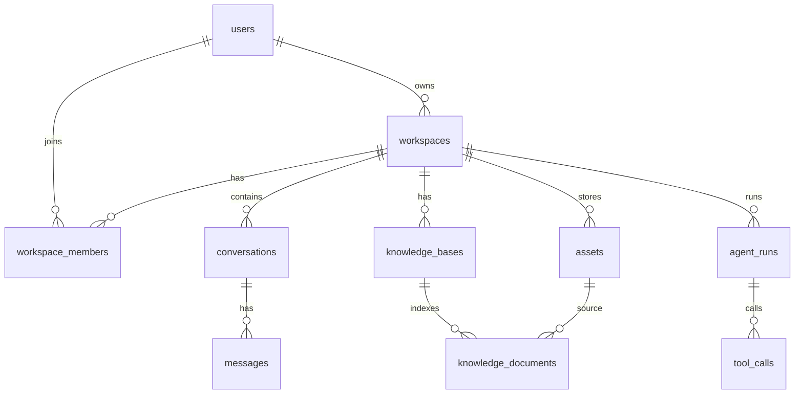

# ERD (Konseptual) + Skema Data Awal

Catatan: ini desain awal yang sengaja “flat & relational” agar gampang dipindah ke SQLite/Postgres.

## Entitas

### 1) users
- id (uuid)
- email (nullable untuk single-user mode)
- display_name
- created_at

### 2) workspaces
- id (uuid)
- name
- owner_user_id → users.id
- created_at

### 3) workspace_members
- workspace_id → workspaces.id
- user_id → users.id
- role (owner/admin/member/viewer)
- created_at

### 4) conversations
- id (uuid)
- workspace_id → workspaces.id
- title
- model_provider (anthropic/openai/local/…)
- model_name
- created_by_user_id → users.id
- created_at

### 5) messages
- id (uuid)
- conversation_id → conversations.id
- role (user/assistant/system/tool)
- content_text (nullable)
- content_json (nullable) — untuk multimodal/tool payload
- token_in (int, nullable)
- token_out (int, nullable)
- created_at

### 6) assets
Menyimpan file/gambar/audio yang dihasilkan atau di-upload.
- id (uuid)
- workspace_id → workspaces.id
- kind (image/audio/file)
- storage_url_or_path
- mime_type
- bytes
- meta_json (prompt, seed, params)
- created_by_user_id → users.id
- created_at

### 7) knowledge_bases
- id (uuid)
- workspace_id → workspaces.id
- name
- embedding_provider
- embedding_model
- created_by_user_id → users.id
- created_at

### 8) knowledge_documents
- id (uuid)
- knowledge_base_id → knowledge_bases.id
- asset_id → assets.id
- source_name
- source_uri (nullable)
- content_sha256 (nullable) — untuk deteksi perubahan dokumen
- status (queued/indexing/ready/failed)
- created_at

### 8b) knowledge_document_versions (opsional, tapi berguna untuk “brain pack”)
- id (uuid)
- knowledge_document_id → knowledge_documents.id
- version (int)
- asset_id → assets.id
- created_at

### 9) agent_runs
- id (uuid)
- workspace_id → workspaces.id
- started_by_user_id → users.id
- agent_name
- status (running/succeeded/failed/cancelled)
- input_json
- output_json
- started_at
- finished_at

### 10) tool_calls
- id (uuid)
- agent_run_id → agent_runs.id
- tool_name
- request_json
- response_json
- status (ok/error)
- created_at

## Relasi (teks)
- users 1—N workspaces (owner)
- workspaces N—N users via workspace_members
- workspaces 1—N conversations
- conversations 1—N messages
- workspaces 1—N assets
- workspaces 1—N knowledge_bases
- knowledge_bases 1—N knowledge_documents
- knowledge_documents 1—N knowledge_document_versions
- workspaces 1—N agent_runs
- agent_runs 1—N tool_calls

## ERD (Mermaid)

